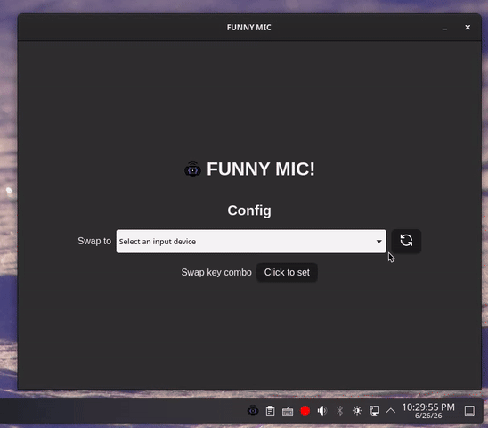

<p align="center"></p>

<h1 align="center">FUNNY MIC!</h1>

Hot swap microphones with a quick keybind!

###### This project was created as a part of [Stardance](https://stardance.hackclub.com/)!

---

<p align="center"></img></p>

<h3 align="center">Customer Testimonial!</h3>
<p align="center">(disclaimer: i am the customer. i was not paid)<br />(ALSO, <strong>THIS IS LOUD</strong>)</p>
<video controlsList="nodownload" align="center" src="https://github.com/user-attachments/assets/a25297f0-f118-4cba-831e-c89c86047efa"></video>

## What does it do?

- Easily configurable & saves on exit
  - Set your key combo by recording it
- Runs in the background
- Multiplatform! (Windows + Linux)
- ...then swap!

## Usage

It's simple!

If you haven't set up FUNNY MIC before, the configuration window should open automatically. Otherwise, you can open it by right clicking the tray icon and clicking **Show**.

Choose the microphone you want to swap to, record a keybind, and you're done!  
(You can close this window now; it will remain in the tray.)

Holding your selected keybind down will act as a push-to-swap, switching back to your previous default when you let go.

If you want to quit, select **Quit** from the tray menu.

## Install

**Direct downloads** are available on the [Releases](https://github.com/hpenney2/funnymic/releases/latest) page for Windows and Linux (.deb + .rpm).

macOS is currently not supported (sorry!).

### Nix

A Nix package is included with [default.nix](default.nix). To install on NixOS, either

1. Clone the repository and install imperatively with `nix-env -f . -i` (not recommended!)
2. Install by including this in your system's (or user's) packages with `pkgs.callPackage`.

## Build

Before anything, run

```
pnpm install
```

---

For development, use

```
pnpm tauri dev
```

To build, use

```
pnpm tauri build
```

## Tech Stack

| Component | Tech               |
| --------- | ------------------ |
| Backend   | Rust + Tauri 2.0   |
| Frontend  | TypeScript + React |

Tauri was decided on largely because I wanted to try it, but also because it holds well compared to other options. In particular, it parallels Electron, with significantly less overhead.

For audio device handling:

- On **Linux**, we directly use the PulseAudio API to get devices and their IDs, and then set the default device.
- On **Windows**, we directly use the Windows API to discover devices and IDs, _but_ the API for actually setting the default device is undocumented. `IPolicyConfig` is used internally by Windows, but we can also access this by defining the interface (which [com-policy-config](https://crates.io/crates/com-policy-config) already does, conveniently!).  
  Calling the Windows API also means using unsafe Rust (!), since it's implemented as a C binding.

For listening for a key combo globally, the [Global Shortcut](https://github.com/tauri-apps/plugins-workspace/tree/v2/plugins/global-shortcut) Tauri plugin is used. **This may potentially result in issues on Wayland**. Please [create an issue](https://github.com/hpenney2/funnymic/issues/new) (or reply to an existing one) if any problems are identified.  
(handling shortcuts ended up being quite a problem!)

## Credits

[Tauri](https://tauri.app/) is used as the primary framework for bringing the backend and frontend together. Its [plugin library](https://github.com/tauri-apps/plugins-workspace) is also heavily utilized.

The frontend relies on the [React](https://react.dev/) framework and additionally uses the [Lucide](https://lucide.dev/) icon pack. (The "headphones" icon from Lucide was also used for the "testimonial" icon in this README).

The name (and logo) is inspired by the infamous Logitech C920/C922 webcam's microphone, dubbed by _some_ as the "funny mic" because it creates horrible noises when screamed at.

## License

[MIT License](LICENSE). Free and open source.
